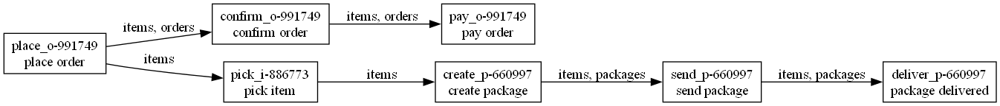

# OCPM Partial Order — Order Management Prototype

Prototipo universitario per la costruzione di **Instance Graph object-centric a ordine parziale** a partire da process execution estratte da un log OCEL 2.0.

Il progetto è sviluppato da **Nicolò Ianni** e **Danilo La Palombara** nell’ambito di Big Data Analytics e Object-Centric Process Mining.

> **Stato attuale:** sono state completate la configurazione dell’ambiente, l’esplorazione del dataset, la discovery preliminare della Object-Centric Petri Net, la costruzione dell’Instance Graph su esempi sintetici e process execution reali, l’inferenza di relazioni candidate di precedenza causale dall’Object-Centric Directly-Follows Graph, lo screening di 22 process execution, il conformance checking per tipo di oggetto e due validazioni holdout prive di sovrapposizioni tra training e test.
>
> Per l’ordine `o-990424` è stato costruito automaticamente un Instance Graph con 7 nodi e 6 archi. Il grafo è un DAG, è transitivamente ridotto e conserva due rami causali incomparabili.
>
> La procedura inferisce 26 relazioni candidate di precedenza causale: 22 tra attività differenti e 4 auto-relazioni. I self-loop permettono di ordinare correttamente le attività ripetute sullo stesso oggetto senza imporre un ordine tra attività uguali riferite a oggetti differenti.
>
> Il conformance checking è stato eseguito separatamente sulle proiezioni `orders`, `items` e `packages`. Tutte le 10.787 proiezioni risultano conformi alle rispettive Petri net componenti, con fitness media pari a 1 e senza token mancanti o residui. Questo risultato non costituisce una fitness object-centric globalmente sincronizzata.
>
> Nella validazione end-to-end degli Instance Graph, le relazioni candidate vengono apprese esclusivamente dalle 44 componenti di training. Le 24 componenti di test non condividono eventi né oggetti con il training. Sui 9 ordini ammissibili secondo la definizione order-centred adottata, tutti i grafi sono DAG connessi, coprono tutti gli eventi, sono transitivamente ridotti e coincidono topologicamente con la baseline full-log. Gli altri 427 ordini sono esclusi per contaminazione strutturale: la copertura esplicita del prototipo è quindi 9/436, pari a circa il 2,06% degli ordini del test.

---

## 1. Obiettivo

Nel process mining tradizionale gli eventi vengono normalmente organizzati in tracce utilizzando un singolo `case_id`. Questa rappresentazione è limitante quando uno stesso evento coinvolge contemporaneamente entità differenti, per esempio:

- un ordine;
- uno o più articoli;
- uno o più pacchi;
- un prodotto;
- un dipendente.

L’Object-Centric Process Mining evita di scegliere in anticipo un unico identificatore di caso e conserva i collegamenti tra eventi e oggetti di tipi differenti.

Questo progetto adatta a tale contesto il concetto di **Instance Graph**. Nel grafo:

- ogni nodo rappresenta un evento della process execution;
- ogni arco rappresenta una dipendenza causale ammessa;
- gli archi sono motivati da almeno un oggetto condiviso;
- gli eventi privi di un ordine causale restano incomparabili;
- la riduzione transitiva elimina gli archi ridondanti senza modificare la raggiungibilità.

L’obiettivo non è trasformare il log in una semplice sequenza cronologica. Il timestamp descrive l’ordine osservato, ma non è sufficiente a dimostrare una dipendenza causale.

Per esempio, se il pagamento viene registrato dopo la consegna, ciò non implica automaticamente:

```text
package delivered -> pay order
```

L’arco viene inserito soltanto se una causal relation applicabile e un oggetto condiviso lo giustificano.

---

## 2. Pipeline del progetto

La pipeline attuale è:

```text
OCEL 2.0 Order Management
        |
        +--> esplorazione del log
        |
        +--> discovery preliminare della OCPN
        |       |
        |       +--> Petri net per orders
        |       +--> Petri net per items
        |       `--> Petri net per packages
        |
        +--> discovery dell’OC-DFG
        |
        +--> scoring delle relazioni
        |       |
        |       +--> dependency measure
        |       +--> supporto relativo
        |       `--> self-loop score
        |
        +--> causal relations filtrate
        |
        +--> estrazione order-centred
        |
        +--> adapter verso il modello interno
        |
        +--> costruzione dell’Instance Graph
        |       |
        |       +--> controllo DAG
        |       +--> controllo di copertura e connessione
        |       +--> riduzione transitiva
        |       +--> ricerca delle coppie incomparabili
        |       `--> controllo delle attività ripetute
        |
        +--> conformance checking per tipo di oggetto
        |       |
        |       +--> flattening delle proiezioni
        |       +--> token-based replay
        |       +--> diagnostica per singolo oggetto
        |       `--> riepilogo per tipo di oggetto
        |
        +--> validazione holdout object-centric basata su grafi
        |       |
        |       +--> split per componenti connesse
        |       +--> OC-DFG, OTG ed ET-OT
        |       `--> confronto strutturale training/test
        |
        `--> validazione holdout end-to-end degli Instance Graph
                |
                +--> relazioni apprese soltanto dal training
                +--> estrazione degli ordini del test
                +--> costruzione e validazione dei grafi
                `--> confronto post-hoc con la baseline full-log
```

Le attività metodologiche devono rimanere distinte:

1. **model discovery:** ricavare un modello dal log;
2. **estrazione:** delimitare una process execution nel log object-centric;
3. **inferenza delle causal relations:** selezionare dipendenze candidate;
4. **costruzione dell’Instance Graph:** applicare le relazioni agli eventi e agli oggetti;
5. **conformance checking:** verificare se le proiezioni sono riproducibili dalle Petri net componenti;
6. **validazione holdout:** misurare la generalizzazione su componenti che non condividono eventi o oggetti con il training.

Il completamento di un’attività non dimostra automaticamente le altre.

---

## 3. Assunzioni e limiti metodologici

La versione attuale assume che:

- la process execution venga estratta con una regola order-centred;
- la chiusura strutturale segua `orders -> items -> packages`;
- `products` ed `employees` non vengano attraversati durante l’espansione;
- le causal relations siano rappresentate a livello di attività e tipo di oggetto;
- il conformance checking venga eseguito separatamente sulle proiezioni dei tipi strutturali;
- non vengano ancora calcolati object-centric alignment globalmente sincronizzati;
- non sia stato ancora eseguito un token-based replay object-centric globalmente sincronizzato;
- il controllo sulle 10.787 proiezioni sia in-sample, perché la OCPN viene scoperta dallo stesso OCEL sottoposto a replay;
- le validazioni holdout separino training e test per componenti connesse del grafo di interazione object-centric;
- la valutazione end-to-end riguardi soltanto gli ordini non contaminati secondo la definizione order-centred adottata;
- non vengano applicati repairing, inserimenti o cancellazioni alla process execution;
- i self-loop di lunghezza 1 siano gestiti mediante una soglia dedicata;
- i loop complessi non siano ancora gestiti in modo generale;
- l’algoritmo rimanga indipendente dalle classi private di PM4Py o OCPA.

`products` ed `employees` vengono conservati negli eventi estratti, ma non vengono usati per espandere la process execution. Nel dataset sono oggetti condivisi trasversalmente e potrebbero collegare ordini differenti in una connected component molto grande.

Le causal relations automatiche non vengono ricavate direttamente dagli archi o dalla semantica di esecuzione della OCPN. Sono inferite dal comportamento osservato nell’OC-DFG mediante misure di frequenza.

---

## 4. Dataset Order Management

Il dataset principale è **Order Management**, distribuito come log OCEL 2.0 in formato SQLite.

Percorso locale:

```text
data/raw/order_management.sqlite
```

Il dataset contiene:

| Elemento | Quantità |
| --- | ---: |
| eventi | 21.008 |
| oggetti | 10.825 |
| relazioni evento-oggetto | 143.463 |
| attività | 11 |
| tipi di oggetto | 5 |

Distribuzione degli oggetti:

| Tipo | Quantità |
| --- | ---: |
| `items` | 7.659 |
| `orders` | 2.000 |
| `packages` | 1.128 |
| `products` | 20 |
| `employees` | 18 |

Attività presenti:

- `place order`;
- `confirm order`;
- `pay order`;
- `pick item`;
- `item out of stock`;
- `reorder item`;
- `create package`;
- `send package`;
- `package delivered`;
- `payment reminder`;
- `failed delivery`.

Il dataset non viene incluso nel repository. Deve essere collocato manualmente in `data/raw/`.

---

## 5. Sviluppo del progetto

### Configurazione dell’ambiente

L’ambiente utilizza:

- Python 3.11 o 3.12;
- PM4Py;
- pandas;
- NetworkX;
- Matplotlib;
- Graphviz;
- pytest;
- Jupyter e ipykernel.

### Esplorazione dell’OCEL

L’esplorazione iniziale verifica:

- tabelle di eventi, oggetti e relazioni;
- tipi di oggetto disponibili;
- attività osservate;
- numerosità e distribuzioni;
- relazioni molti-a-molti tra eventi e oggetti.

### Discovery preliminare della OCPN

La Object-Centric Petri Net viene scoperta con PM4Py. La struttura restituita contiene una Petri net tradizionale per ciascun tipo di oggetto.

Le componenti relative a `orders` e `packages` sono sufficientemente chiare. La componente relativa a `items` è più ciclica e generalizzante.

Una semplice analisi di raggiungibilità tra transizioni visibili produceva, per `items`, 42 relazioni rilevanti rispetto alle due attese nel caso di riferimento, includendo relazioni reciproche e auto-relazioni. La raggiungibilità nella rete non è stata quindi usata direttamente come causalità dell’Instance Graph.

### Toy example

Il primo controllo usa un esempio sintetico con sette eventi e relazioni causali note. Sono verificati:

- costruzione del grafo;
- assenza di cicli;
- riduzione transitiva;
- conservazione dello stesso ordine parziale dopo il riordinamento temporale di eventi indipendenti.

Il test centrale dimostra che l’inversione temporale di eventi appartenenti a rami indipendenti non modifica il grafo causale.

### Process execution reale `o-990424`

La prima process execution reale selezionata è centrata sull’ordine `o-990424` e contiene:

- ordine `o-990424`;
- articolo `i-881734`;
- pacco `p-660247`;
- 7 eventi complessivi.

Le attività osservate in ordine temporale sono:

```text
place order
-> confirm order
-> pick item
-> create package
-> send package
-> package delivered
-> pay order
```

La baseline manuale contiene sei relazioni e genera due rami dopo `place order`:

```text
ramo amministrativo:
place order -> confirm order -> pay order

ramo logistico:
place order -> pick item -> create package
-> send package -> package delivered
```

L’Instance Graph risultante contiene:

- 7 nodi;
- 6 archi;
- nessun ciclo;
- nessun arco transitivo ridondante;
- 8 coppie di eventi incomparabili tra i due rami.

Il fatto che `pay order` abbia un timestamp successivo a `package delivered` non introduce una dipendenza causale tra consegna e pagamento.

### Inferenza automatica delle relazioni candidate

Le relazioni candidate di precedenza causale vengono inferite dall’Object-Centric Directly-Follows Graph. Per ogni coppia di attività e tipo di oggetto vengono calcolate frequenza, direzione predominante e rilevanza relativa. Nel codice il tipo continua a chiamarsi `CausalRelation`, ma il nome non implica che il grafo direttamente-segue dimostri una causalità semantica: indica la relazione operativa usata per decidere quali archi sono ammessi nell’Instance Graph.

Per attività differenti viene usata la dependency measure:

```text
dependency(a, b) =
    (frequency(a, b) - frequency(b, a))
    / (frequency(a, b) + frequency(b, a) + 1)
```

Il supporto relativo confronta la frequenza dell’arco con la massima frequenza uscente dalla stessa attività:

```text
relative_support(a, b) =
    frequency(a, b)
    / max_outgoing_frequency(a)
```

Le soglie predefinite sono:

```text
dependency threshold = 0.90
relative support threshold = 0.05
```

Con queste soglie vengono selezionate automaticamente 22 causal relations tra attività differenti. Dieci sono applicabili alla process execution `o-990424` e producono esattamente i sei archi della baseline, senza archi mancanti o aggiuntivi.

La prima analisi esplorativa di sensibilità considerava 24 combinazioni di soglie sul caso di riferimento: la topologia attesa veniva mantenuta in 15 configurazioni. Questo risultato era utile durante lo sviluppo, ma era ancora una verifica in-sample sul caso noto.

Nella validazione holdout finale le soglie predefinite restano fissate prima di osservare i risultati del test. Una seconda griglia di 24 configurazioni viene ora calcolata esclusivamente sul sotto-log di training e confronta ciascun set di relazioni con quello prodotto dalla configurazione predefinita. Questa diagnostica misura la stabilità del modello appreso senza usare il test per scegliere retroattivamente i parametri. Nell'esecuzione verificata, 8 configurazioni su 24 mantengono esattamente il set di relazioni prodotto dalla configurazione predefinita.

### Self-loop

Per una relazione nella quale attività sorgente e destinazione coincidono viene usato un punteggio dedicato:

```text
self_loop_score(a) =
    frequency(a, a)
    / (frequency(a, a) + 1)
```

La soglia predefinita è:

```text
self-loop threshold = 0.90
```

La procedura deriva quattro auto-relazioni. Complessivamente vengono quindi selezionate 26 causal relations:

```text
22 relazioni tra attività differenti
+ 4 auto-relazioni
= 26 causal relations
```

I self-loop vengono applicati soltanto a eventi consecutivi della stessa attività che condividono lo stesso oggetto. Attività uguali associate a oggetti differenti restano incomparabili.

### Screening delle 22 process execution

Tra i 2.000 ordini del dataset sono state individuate 22 process execution complete e non contaminate secondo la regola di estrazione adottata.

Per ogni execution vengono verificati:

- costruzione del grafo;
- assenza di cicli;
- connessione;
- copertura di tutti gli eventi;
- assenza di eventi isolati;
- riduzione transitiva;
- comportamento delle attività ripetute.

Risultati:

```text
execution analizzate: 22
grafi DAG: 22
grafi connessi: 22
grafi transitivamente ridotti: 22
execution con eventi isolati: 0
ripetizioni sospette: 0
```

Il caso `o-990254` contiene due eventi `failed delivery`, correttamente ordinati in una catena sullo stesso pacco.

Il caso `o-990042` contiene sette eventi `failed delivery`, anch’essi ordinati sullo stesso oggetto senza introdurre un ciclo.

Quando due eventi `pick item` riguardano articoli differenti, restano invece incomparabili.

### Conformance checking per tipo di oggetto

PM4Py non fornisce, nella versione utilizzata, un replay specifico di una singola process execution contro una OCPN con sincronizzazione globale tra tutti i tipi di oggetto.

Il progetto esegue quindi un controllo formale sulle singole proiezioni:

1. l’OCEL viene appiattito rispetto a un tipo di oggetto;
2. ogni oggetto diventa il caso di una traccia tradizionale;
3. la traccia viene confrontata con la Petri net componente dello stesso tipo;
4. PM4Py esegue il token-based replay;
5. vengono raccolti fitness, token mancanti e token residui.

Per `o-990424`:

| Tipo | Oggetto | Eventi | Fit | Fitness | Missing | Remaining |
| --- | --- | ---: | --- | ---: | ---: | ---: |
| `orders` | `o-990424` | 3 | sì | 1.0 | 0 | 0 |
| `items` | `i-881734` | 7 | sì | 1.0 | 0 | 0 |
| `packages` | `p-660247` | 3 | sì | 1.0 | 0 | 0 |

Controllo sull’intero log:

| Tipo | Tracce | Conformi | Non conformi | Fitness media | Missing | Remaining |
| --- | ---: | ---: | ---: | ---: | ---: | ---: |
| `orders` | 2.000 | 2.000 | 0 | 1.0 | 0 | 0 |
| `items` | 7.659 | 7.659 | 0 | 1.0 | 0 | 0 |
| `packages` | 1.128 | 1.128 | 0 | 1.0 | 0 | 0 |
| **Totale** | **10.787** | **10.787** | **0** | **1.0** | **0** | **0** |

Questa è una verifica in-sample: la OCPN è stata scoperta dallo stesso OCEL sottoposto al replay. Il risultato misura la capacità delle componenti scoperte di riprodurre le proprie proiezioni, non la generalizzazione su dati esterni.

### Controlli negativi

Il controllo non si limita ad accettare le tracce originali. La proiezione del pacco `p-660247` è stata modificata artificialmente per verificare che PM4Py riconosca le deviazioni.

| Scenario | Token fitness | Alignment fitness | Esito |
| --- | ---: | ---: | --- |
| traccia originale | 1.0 | 1.0 | conforme |
| evento finale rimosso | 0.6667 | 0.8 | non conforme |
| attività non prevista | 0.6667 | 0.6667 | non conforme |
| ordine invertito | 0.5 | 0.3333 | non conforme |

La transizione invisibile presente nell’allineamento della traccia originale appartiene al modello e non rappresenta una deviazione.

### Validazione holdout object-centric basata su grafi

Per ridurre il leakage, l’OCEL viene suddiviso per componenti connesse del grafo di interazione considerando i tipi strutturali `orders`, `items` e `packages`. Training e test non condividono eventi né oggetti.

La validazione confronta strutturalmente training e test mediante tre rappresentazioni native di PM4Py:

- Object-Centric Directly-Follows Graph (OC-DFG);
- Object Type Graph (OTG);
- Event Type–Object Type graph (ET-OT).

Per ogni rappresentazione vengono conservate sia le diagnostiche predefinite sia confronti strutturali simmetrici. Le differenze di frequenza dovute alla diversa dimensione dei due sotto-log non vengono confuse con differenze di struttura.

L’esperimento è implementato in `object_centric_graph_validation.py`, verificato da `test_object_centric_graph_validation.py`, riproducibile con `check_object_centric_graph_conformance.py` e documentato nel notebook `09_object_centric_graph_conformance.ipynb`.

Questi risultati forniscono evidenza di generalizzazione object-centric out-of-sample a livello di grafi, ma non dimostrano una fitness globalmente sincronizzata della OCPN.

### Validazione holdout end-to-end degli Instance Graph

La validazione conclusiva esegue l’intera pipeline senza utilizzare il test durante l’apprendimento:

```text
OCEL completo
    -> split per componenti connesse
    -> OC-DFG sul solo training
    -> causal relations dal solo training
    -> estrazione degli ordini del test
    -> costruzione degli Instance Graph
    -> validazione strutturale
    -> confronto post-hoc con baseline full-log
```

Separazione dei dati:

```text
componenti totali: 68
componenti training: 44
componenti test: 24
eventi training: 16547
eventi test: 4461
oggetti training: 8531
oggetti test: 2256
rapporto effettivo training: 0.7877
eventi condivisi: 0
oggetti condivisi: 0
```

Apprendimento delle relazioni:

```text
dependency threshold: 0.90
relative support threshold: 0.05
self-loop threshold: 0.90
relazioni training: 26
relazioni baseline full-log: 26
relazioni mancanti: 0
relazioni aggiuntive: 0
set esattamente coincidente: sì
```

Selezione e risultati:

```text
ordini presenti nel test: 436
ordini esclusi per contaminazione strutturale: 427
ordini valutabili: 9
copertura del prototipo: 2,06%
grafi strutturalmente validi: 9
grafi con topologia esatta: 9
```

Tutti i nove grafi valutati sono DAG, connessi, coprono tutti gli eventi e sono transitivamente ridotti. Le topologie coincidono con quelle costruite usando le relazioni della baseline full-log.

| Ordine | Eventi | Nodi | Archi | Valido | Topologia esatta |
| --- | ---: | ---: | ---: | --- | --- |
| `o-991144` | 11 | 11 | 14 | sì | sì |
| `o-991284` | 8 | 8 | 8 | sì | sì |
| `o-991324` | 11 | 11 | 14 | sì | sì |
| `o-991520` | 11 | 11 | 12 | sì | sì |
| `o-991630` | 9 | 9 | 10 | sì | sì |
| `o-991686` | 10 | 10 | 12 | sì | sì |
| `o-991749` | 7 | 7 | 6 | sì | sì |
| `o-991925` | 11 | 11 | 14 | sì | sì |
| `o-991982` | 9 | 9 | 10 | sì | sì |

La baseline full-log viene usata soltanto dopo la costruzione dei grafi holdout per confrontarne la topologia. I 427 ordini esclusi attraversano collegamenti con item o ordini estranei rispetto al caso centrato sull’ordine: sono fuori dal dominio di applicabilità del prototipo corrente e non rappresentano fallimenti dei nove grafi valutati. Il programma conserva ora, per ogni esclusione, l’ordine coinvolto, gli item estranei, gli ordini estranei e un codice del motivo; lo script stampa i conteggi aggregati e alcuni esempi. La copertura del 2,06% deve essere riportata insieme ai risultati 9/9, perché delimita con precisione l’ambito in cui il prototipo è stato valutato.

I risultati mostrano quindi una generalizzazione end-to-end sui casi **ammissibili** secondo l’estrazione order-centred adottata. Non dimostrano validità sui 427 casi esclusi, causalità semantica delle relazioni inferite o fitness globalmente sincronizzata della Object-Centric Petri Net.


### Grafi holdout esportati

I nove Instance Graph costruiti con le relazioni candidate inferite esclusivamente dal training sono disponibili nella cartella `outputs/holdout_instance_graphs`.

Il caso `o-991749`, composto da sette eventi e sei archi, costituisce l'esempio più compatto da utilizzare durante una dimostrazione:



Gli altri otto file permettono di mostrare process execution con un numero maggiore di eventi e ramificazioni. Tutte le immagini sono rigenerabili mediante l'opzione `--export-graphs`.

---

## 6. Modello dati interno

Il modello interno separa il dominio del progetto dalle strutture private degli strumenti esterni.

### `ObjectReference`

Rappresenta un oggetto mediante:

- tipo di oggetto;
- identificatore dell’oggetto.

### `ExecutionEvent`

Rappresenta un evento mediante:

- identificatore;
- attività;
- timestamp;
- riferimenti agli oggetti coinvolti.

### `ProcessExecution`

Contiene l’insieme ordinato degli eventi appartenenti alla process execution estratta.

### `CausalRelation`

Rappresenta una relazione tra:

- attività sorgente;
- attività destinazione;
- tipo di oggetto che giustifica la relazione.

### `CausalRelationEvidence`

Associa a una causal relation candidata:

- frequenza nella direzione osservata;
- frequenza nella direzione opposta;
- dependency measure;
- supporto relativo;
- eventuale self-loop score.

### Risultati di conformance

Il package `conformance` espone strutture immutabili per rappresentare:

- diagnostica di una singola traccia;
- riepilogo di tutte le tracce di un tipo;
- aggregazione delle proiezioni appartenenti a una process execution.

---

## 7. Costruzione dell’Instance Graph

Un arco tra due eventi viene inserito quando:

1. le attività corrispondono a una causal relation selezionata;
2. gli eventi condividono almeno un oggetto del tipo indicato dalla relazione;
3. l’ordine degli eventi è compatibile con la relazione;
4. per un self-loop, gli eventi appartengono allo stesso oggetto.

Dopo la costruzione vengono eseguiti:

- controllo di aciclicità;
- controllo di copertura;
- controllo di connessione;
- riduzione transitiva;
- individuazione delle coppie incomparabili.

Il risultato è un DAG che rappresenta un ordine parziale, non una semplice sequenza temporale.

---

## 8. Incomparabilità e parallelismo potenziale

Due eventi sono incomparabili quando non esiste un cammino dal primo al secondo né dal secondo al primo.

L’incomparabilità indica che le causal relations disponibili non impongono un ordine tra gli eventi. Può essere compatibile con il parallelismo, ma non ne costituisce da sola una prova definitiva.

Una coppia incomparabile può dipendere anche da:

- relazioni causali mancanti;
- soglie troppo restrittive;
- rumore nel log;
- limiti del modello;
- semantica non rappresentata.

Per questo motivo l’incomparabilità viene usata come proprietà del grafo e viene descritta come **parallelismo potenziale**.

---

## 9. Struttura del repository

```text
ocpm-partial-order/
|-- data/
|   |-- raw/
|   |   `-- order_management.sqlite
|   |-- samples/
|   |   |-- order_management_toy_execution.json
|   |   |-- order_management_toy_execution_reordered.json
|   |   `-- order_management_toy_causal_relations.json
|   `-- derived/
|       `-- order_management_o_990424_causal_relations.json
|
|-- notebooks/
|   |-- 01_environment_check.ipynb
|   |-- 02_ocel_exploration.ipynb
|   |-- 03_ocpn_discovery.ipynb
|   |-- 04_real_instance_graph.ipynb
|   |-- 05_instance_graph.ipynb
|   |-- 06_real_execution.ipynb
|   |-- 07_conformance_checking.ipynb
|   |-- 08_out_of_sample_validation.ipynb
|   |-- 09_object_centric_graph_conformance.ipynb
|   `-- 10_instance_graph_holdout_validation.ipynb
|
|-- outputs/
|   |-- figures/
|   |-- graphs/
|   |-- reports/
|   `-- tables/
|
|-- scripts/
|   |-- check_environment.py
|   |-- check_instance_graph_holdout.py
|   |-- check_object_centric_graph_conformance.py
|   |-- check_object_type_conformance.py
|   |-- check_out_of_sample_conformance.py
|   |-- inspect_ocel.py
|   |-- inspect_order_candidates.py
|   |-- run_order_management_discovered.py
|   |-- run_order_management_real.py
|   |-- run_order_management_toy.py
|   |-- run_toy_example.py
|   |-- screen_order_executions.py
|   `-- verify_real_execution.py
|
|-- src/ocpm_partial_order/
|   |-- config.py
|   |-- conformance/
|   |   |-- __init__.py
|   |   |-- holdout_validation.py
|   |   |-- instance_graph_holdout_validation.py
|   |   |-- object_centric_graph_validation.py
|   |   `-- object_type_replay.py
|   |-- discovery/
|   |   |-- causal_relations.py
|   |   `-- ocpn_discovery.py
|   |-- domain/
|   |   |-- causal_relation.py
|   |   |-- event.py
|   |   `-- process_execution.py
|   |-- extraction/
|   |   `-- execution_adapter.py
|   |-- graphs/
|   |   |-- concurrency.py
|   |   |-- instance_graph.py
|   |   `-- validation.py
|   |-- io/
|   |   |-- ocel_loader.py
|   |   `-- sample_loader.py
|   `-- visualization/
|       `-- graph_visualizer.py
|
|-- tests/
|   |-- fixtures/
|   |-- test_causal_relations.py
|   |-- test_concurrency.py
|   |-- test_discovered_causal_relations.py
|   |-- test_equivalent_linearizations.py
|   |-- test_execution_adapter.py
|   |-- test_instance_graph.py
|   |-- test_instance_graph_holdout_validation.py
|   |-- test_object_centric_graph_validation.py
|   |-- test_object_type_conformance.py
|   |-- test_holdout_validation.py
|   |-- test_real_instance_graph.py
|   |-- test_real_self_loops.py
|   `-- test_sample_loader.py
|
|-- .gitignore
|-- pyproject.toml
|-- requirements.txt
`-- README.md
```

Gli artefatti in `outputs/` sono rigenerabili e possono essere esclusi dal versionamento.

Il dataset in `data/raw/` resta locale. Il file in `data/derived/` rappresenta la baseline manuale riproducibile.

---

## 10. Installazione su Windows

### Prerequisiti

- Python 3.11 o 3.12;
- Git;
- Graphviz.

Verifica di Python:

```powershell
python --version
```

Verifica di Graphviz:

```powershell
dot -V
```

### Creazione dell’ambiente virtuale

```powershell
python -m venv .venv
```

Aggiornamento di `pip`:

```powershell
.\.venv\Scripts\python.exe -m pip install --upgrade pip
```

Installazione del progetto con dipendenze di sviluppo:

```powershell
.\.venv\Scripts\python.exe -m pip install -e ".[dev]"
```

Non è necessario attivare l’ambiente virtuale se si invoca direttamente il relativo eseguibile Python.

### Dataset

Copiare il dataset nel percorso:

```text
data/raw/order_management.sqlite
```

---

## 11. Esecuzione

Tutti i comandi seguenti devono essere eseguiti dalla radice del repository.

### Controllo dell’ambiente

```powershell
.\.venv\Scripts\python.exe .\scripts\check_environment.py
```

### Ispezione dell’OCEL

```powershell
.\.venv\Scripts\python.exe .\scripts\inspect_ocel.py
```

### Selezione dei candidati

```powershell
.\.venv\Scripts\python.exe .\scripts\inspect_order_candidates.py
```

### Toy example

```powershell
.\.venv\Scripts\python.exe .\scripts\run_toy_example.py
```

### Verifica dell’estrazione reale

```powershell
.\.venv\Scripts\python.exe .\scripts\verify_real_execution.py
```

### Caso reale con relazioni manuali

```powershell
.\.venv\Scripts\python.exe .\scripts\run_order_management_real.py
```

### Caso reale con relazioni automatiche

```powershell
.\.venv\Scripts\python.exe .\scripts\run_order_management_discovered.py
```

### Screening delle 22 process execution

```powershell
.\.venv\Scripts\python.exe .\scripts\screen_order_executions.py
```

### Conformance checking per tipo di oggetto

```powershell
.\.venv\Scripts\python.exe .\scripts\check_object_type_conformance.py
```

Lo script controlla la process execution di riferimento e tutte le proiezioni strutturali:

```text
proiezioni strutturali: 10787
proiezioni conformi: 10787
proiezioni non conformi: 0
token mancanti: 0
token residui: 0
```

### Validazione out-of-sample delle proiezioni

```powershell
.\.venv\Scripts\python.exe .\scripts\check_out_of_sample_conformance.py
```

### Validazione holdout object-centric basata su grafi

```powershell
.\.venv\Scripts\python.exe .\scripts\check_object_centric_graph_conformance.py
```

### Validazione holdout end-to-end degli Instance Graph

```powershell
.\.venv\Scripts\python.exe .\scripts\check_instance_graph_holdout.py
```

Per eseguire la stessa validazione ed esportare in PNG tutti i grafi holdout valutati:

```powershell
.\.venv\Scripts\python.exe .\scripts\check_instance_graph_holdout.py `
    --export-graphs
```

I file vengono salvati in `outputs\holdout_instance_graphs`. Per aprire la cartella da PowerShell:

```powershell
Invoke-Item .\outputs\holdout_instance_graphs
```

È possibile scegliere una cartella diversa indicando il percorso dopo `--export-graphs`.

---

## 12. Notebook

Avvio di Jupyter Lab:

```powershell
.\.venv\Scripts\python.exe -m jupyter lab
```

Ordine consigliato:

1. `01_environment_check.ipynb`;
2. `02_ocel_exploration.ipynb`;
3. `03_ocpn_discovery.ipynb`;
4. `04_real_instance_graph.ipynb`;
5. `05_instance_graph.ipynb`;
6. `06_real_execution.ipynb`;
7. `07_conformance_checking.ipynb`;
8. `08_out_of_sample_validation.ipynb`;
9. `09_object_centric_graph_conformance.ipynb`;
10. `10_instance_graph_holdout_validation.ipynb`.

### Notebook 04

Documenta l’estrazione order-centred e la baseline manuale sul caso reale.

### Notebook 05

Documenta:

- analisi della OCPN;
- limite della raggiungibilità ingenua;
- discovery dell’OC-DFG;
- dependency e supporto relativo;
- sensitivity analysis;
- confronto tra relazioni automatiche e baseline.

Validazione:

```text
celle totali: 24
celle di codice: 9
celle eseguite: 9
errori: 0
```

### Notebook 06

Documenta:

- le 26 causal relations;
- le quattro auto-relazioni;
- il self-loop score;
- lo screening delle 22 execution;
- i casi con più item e pacchi;
- le principali eccezioni;
- le catene di `failed delivery`;
- l’incomparabilità su oggetti differenti;
- i limiti metodologici.

Validazione:

```text
celle totali: 22
celle di codice: 10
celle eseguite: 10
errori: 0
validazione notebook: superata
```

### Notebook 07

Documenta:

- il conformance checking per tipo di oggetto;
- le proiezioni `orders`, `items` e `packages`;
- il token-based replay rispetto alle Petri net componenti;
- la conformità delle proiezioni di `o-990424`;
- il riepilogo sulle 10.787 proiezioni strutturali;
- un controllo negativo con la rimozione dell’attività finale;
- la distinzione tra fitness delle proiezioni e fitness object-centric globalmente sincronizzata;
- il carattere in-sample dell’esperimento.

Validazione:

```text
celle totali: 16
celle di codice: 8
celle eseguite: 8
errori salvati: 0
validazione notebook: superata
```

Esecuzione non interattiva del notebook 07:

```powershell
.\.venv\Scripts\python.exe -m jupyter nbconvert `
    --to notebook `
    --execute `
    --inplace `
    .\notebooks\07_conformance_checking.ipynb `
    --ExecutePreprocessor.timeout=600
```

### Notebook 08

Documenta:

- il leakage prodotto da uno split ingenuo dei casi;
- le 131 condivisioni di evento rilevate per `items`;
- la costruzione dello split per componenti connesse;
- la discovery eseguita esclusivamente sui training set;
- il token-based replay su 2.202 tracce out-of-sample;
- precisione, generalizzazione e semplicità dei modelli;
- la bassa precisione della componente `items`;
- i limiti della validazione component-aware.

Validazione:

```text
celle totali: 16
celle di codice: 7
celle eseguite: 7
errori salvati: 0
validazione notebook: superata
```

Esecuzione non interattiva del notebook 08:

```powershell
.\.venv\Scripts\python.exe -m jupyter nbconvert `
    --to notebook `
    --execute `
    --inplace `
    --ExecutePreprocessor.timeout=600 `
    .\notebooks\08_out_of_sample_validation.ipynb
```

### Notebook 09

Documenta:

- lo split nativo dell’OCEL per componenti connesse;
- l’assenza di eventi e oggetti condivisi tra training e test;
- la discovery separata delle rappresentazioni object-centric;
- la validazione holdout mediante OC-DFG, OTG ed ET-OT;
- le diagnostiche PM4Py predefinite;
- i confronti strutturali simmetrici tra training e test;
- la distinzione tra copertura strutturale, generalizzazione object-centric e fitness OCPN globalmente sincronizzata;
- i limiti dell’esperimento basato sui grafi.

Esecuzione non interattiva del notebook 09:

```powershell
.\.venv\Scripts\python.exe -m jupyter nbconvert `
    --to notebook `
    --execute `
    --inplace `
    --ExecutePreprocessor.timeout=600 `
    .\notebooks\09_object_centric_graph_conformance.ipynb
```

### Notebook 10

Documenta:

- lo split delle 68 componenti in 44 componenti di training e 24 di test;
- l’assenza di eventi e oggetti condivisi tra i due sotto-log;
- la derivazione delle 26 causal relations dal solo training;
- il confronto post-hoc con le 26 relazioni della baseline full-log;
- la selezione dei 9 ordini ammissibili e l’esclusione motivata di 427 ordini contaminati;
- la costruzione e validazione end-to-end dei nove Instance Graph;
- la corrispondenza topologica esatta con la baseline;
- la distinzione tra generalizzazione sui casi ammissibili e fitness OCPN globalmente sincronizzata.

Validazione:

```text
celle totali: 14
celle di codice: 6
celle non eseguite: 0
errori: 0
validazione notebook: superata
```

Esecuzione non interattiva del notebook 10:

```powershell
.\.venv\Scripts\python.exe -m jupyter nbconvert `
    --to notebook `
    --execute `
    --inplace `
    --ExecutePreprocessor.timeout=600 `
    .\notebooks\10_instance_graph_holdout_validation.ipynb
```

Gli avvisi ZMQ relativi al Proactor event loop e al TCP locale non indicano un errore del notebook. La verifica rilevante è l’assenza di output con `output_type = error`.

---

## 13. Test automatici

Esecuzione completa:

```powershell
.\.venv\Scripts\python.exe -m pytest -v
```

Risultato verificato dopo l’estensione diagnostica ed esportazione grafica:

```text
73 passed
```

La suite completa aggiornata è stata eseguita sul dataset reale e termina con `73 passed`.

La suite comprende:

| Area | Verifica |
| --- | --- |
| caricamento | parsing degli input sintetici |
| modello dati | eventi e oggetti |
| grafo | nodi, archi, DAG e riduzione transitiva |
| incomparabilità | rami causali distinti |
| linearizzazioni | stesso grafo per ordini temporali equivalenti |
| adapter | conversione dell’OCEL nel modello interno |
| estrazione | delimitazione order-centred |
| baseline reale | proprietà di `o-990424` |
| scoring | dependency e supporto relativo |
| self-loop | calcolo e filtraggio delle auto-relazioni |
| discovery reale | relazioni automatiche attese |
| loop reali | catene di `failed delivery` |
| oggetti differenti | attività uguali lasciate incomparabili |
| screening | validazione strutturale di 22 execution |
| conformance | replay delle proiezioni e diagnostica di fitness |
| controllo negativo | riconoscimento di una traccia incompleta |
| holdout per tipo | discovery e replay senza leakage tra componenti |
| grafi object-centric | OC-DFG, OTG ed ET-OT su training e test separati |
| end-to-end | apprendimento training-only e topologia degli Instance Graph di test |

I sei test di conformance verificano:

- conformità delle proiezioni della process execution di riferimento;
- aggregazione delle misure di fitness;
- conformità delle 1.128 proiezioni dei pacchi;
- riconoscimento di una traccia incompleta;
- rifiuto di un tipo di oggetto sconosciuto;
- rifiuto di un identificatore di oggetto sconosciuto.

I 15 test end-to-end verificano inoltre:

- valori predefiniti e validazione delle soglie;
- esportazioni pubbliche del modulo;
- assenza di sovrapposizioni tra training e test;
- apprendimento delle relazioni dal solo training;
- rilevazione della contaminazione strutturale;
- conservazione del motivo strutturato delle esclusioni;
- calcolo della copertura effettiva del prototipo;
- analisi di sensibilità delle soglie sul solo training;
- esportazione dei grafi holdout valutati;
- proprietà DAG, connessione, copertura e riduzione transitiva;
- confronto topologico con la baseline full-log;
- riepilogo aggregato della valutazione.

---

## 14. Risultati dimostrati

Il progetto dimostra:

- caricamento ed esplorazione del dataset OCEL 2.0;
- discovery preliminare della OCPN;
- modello dati interno indipendente da PM4Py;
- costruzione dell’Instance Graph sintetico;
- equivalenza di linearizzazioni temporali indipendenti;
- estrazione order-centred di process execution reali;
- baseline manuale per `o-990424`;
- derivazione automatica dall’OC-DFG;
- scoring mediante dependency e supporto relativo;
- gestione dei self-loop di lunghezza 1;
- derivazione di 26 causal relations;
- corrispondenza esatta con la baseline di `o-990424`;
- screening di 22 process execution reali;
- 22 grafi DAG, connessi e transitivamente ridotti;
- assenza di eventi isolati e ripetizioni sospette;
- ordinamento delle ripetizioni sullo stesso oggetto;
- conservazione dell’incomparabilità su oggetti differenti;
- token-based replay sulle proiezioni `orders`, `items` e `packages`;
- conformità delle 10.787 proiezioni alle rispettive Petri net componenti;
- fitness media delle proiezioni pari a 1;
- assenza di token mancanti e residui nelle proiezioni complete;
- riconoscimento di tracce alterate mediante controlli negativi;
- split holdout per componenti connesse senza eventi o oggetti condivisi;
- validazione object-centric out-of-sample mediante OC-DFG, OTG ed ET-OT;
- apprendimento training-only delle 26 causal relations;
- corrispondenza esatta tra relazioni training e baseline full-log;
- costruzione di 9 Instance Graph ammissibili sul test;
- validità strutturale di tutti i 9 grafi holdout;
- corrispondenza topologica esatta di tutti i 9 grafi con la baseline;
- esecuzione senza errori dei notebook 05, 06, 07, 08, 09 e 10;
- superamento di 73 test automatici.

---

## 15. Risultati non ancora dimostrati

Il progetto non dimostra ancora:

- fitness object-centric globalmente sincronizzata pari a 1;
- conformance checking con sincronizzazione simultanea tra tipi di oggetto;
- token-based replay object-centric globale;
- object-centric alignment;
- repairing della process execution;
- gestione generale di eventi mancanti o aggiuntivi;
- fitness globalmente sincronizzata della OCPN su un log di test separato;
- validità delle soglie su tutte le 2.000 process execution;
- selezione ottimale delle soglie mediante una procedura di model selection annidata; l’analisi training-only corrente è una diagnostica di stabilità;
- correttezza su dataset differenti;
- gestione generale di loop complessi;
- disambiguazione generale di transizioni diverse con la stessa etichetta;
- derivazione diretta dalla semantica della OCPN;
- equivalenza generale tra OC-DFG filtrato e causalità del modello;
- identificazione certa del parallelismo reale dalla sola incomparabilità;
- scalabilità della costruzione dei grafi su tutte le process execution del log;
- validità del metodo sui 427 ordini esclusi per contaminazione strutturale;
- generalizzazione oltre i 9 ordini ammissibili presenti nel test corrente.

I risultati ottenuti costituiscono una verifica sperimentale sul dataset e sui casi selezionati, non una dimostrazione universale.

---

## 16. Riproducibilità

### Avvio da una PowerShell pulita

Aprire una nuova finestra PowerShell e posizionarsi nella cartella che contiene `README.md`, `pyproject.toml`, `src`, `scripts`, `tests` e `notebooks`:

```powershell
Set-Location C:\Users\nicol\ocpm-partial-order\ocpm-partial-order

Test-Path .\README.md
Test-Path .\.venv\Scripts\python.exe
Test-Path .\data\order_management.sqlite
```

I tre comandi `Test-Path` devono restituire `True`. Il prefisso corretto per l’interprete virtuale è sempre `.\.venv\Scripts\python.exe`: il punto e la barra rovesciata indicano esplicitamente a PowerShell di eseguire il file presente nella cartella corrente.

Verifica dell’ambiente:

```powershell
.\.venv\Scripts\python.exe .\scripts\check_environment.py
```

Esecuzione della suite completa:

```powershell
.\.venv\Scripts\python.exe -m pytest -v
```

Esecuzione dello screening:

```powershell
.\.venv\Scripts\python.exe .\scripts\screen_order_executions.py
```

Esecuzione del conformance checking:

```powershell
.\.venv\Scripts\python.exe .\scripts\check_object_type_conformance.py
```

Esecuzione della validazione out-of-sample delle proiezioni:

```powershell
.\.venv\Scripts\python.exe .\scripts\check_out_of_sample_conformance.py
```

Esecuzione della validazione object-centric basata su grafi:

```powershell
.\.venv\Scripts\python.exe .\scripts\check_object_centric_graph_conformance.py
```

Esecuzione della validazione end-to-end degli Instance Graph:

```powershell
.\.venv\Scripts\python.exe .\scripts\check_instance_graph_holdout.py
```

Esecuzione della validazione con esportazione dei grafi PNG:

```powershell
.\.venv\Scripts\python.exe .\scripts\check_instance_graph_holdout.py `
    --export-graphs

Invoke-Item .\outputs\holdout_instance_graphs
```

Il primo comando deve mostrare lo split senza eventi o oggetti condivisi, la diagnostica delle esclusioni, la copertura, la sensibilità calcolata sul solo training e i risultati dei nove grafi. Il secondo apre Esplora file nella cartella contenente le immagini.

Esecuzione del notebook conclusivo:

```powershell
.\.venv\Scripts\python.exe -m jupyter nbconvert `
    --to notebook `
    --execute `
    --inplace `
    .\notebooks\10_instance_graph_holdout_validation.ipynb `
    --ExecutePreprocessor.timeout=600
```

Controllo finale del repository:

```powershell
git diff --check
git status --short
```

Per riprodurre completamente gli esperimenti è necessario disporre localmente del dataset `order_management.sqlite`.

---

## 17. Riferimenti

- W. M. P. van der Aalst, *Object-Centric Process Mining: Dealing With Divergence and Convergence in Event Data*.
- A. Berti, S. J. van Zelst e W. M. P. van der Aalst, *Process Mining for Python (PM4Py): Bridging the Gap Between Process- and Data Science*.
- J. N. Adams et al., *Defining Cases and Variants for Object-Centric Event Data*.
- [OCEL standard](https://www.ocel-standard.org/).
- [PM4Py](https://github.com/process-intelligence-solutions/pm4py).
- [NetworkX](https://networkx.org/).

---

## Autori

**Nicolò Ianni**
**Danilo La Palombara**
